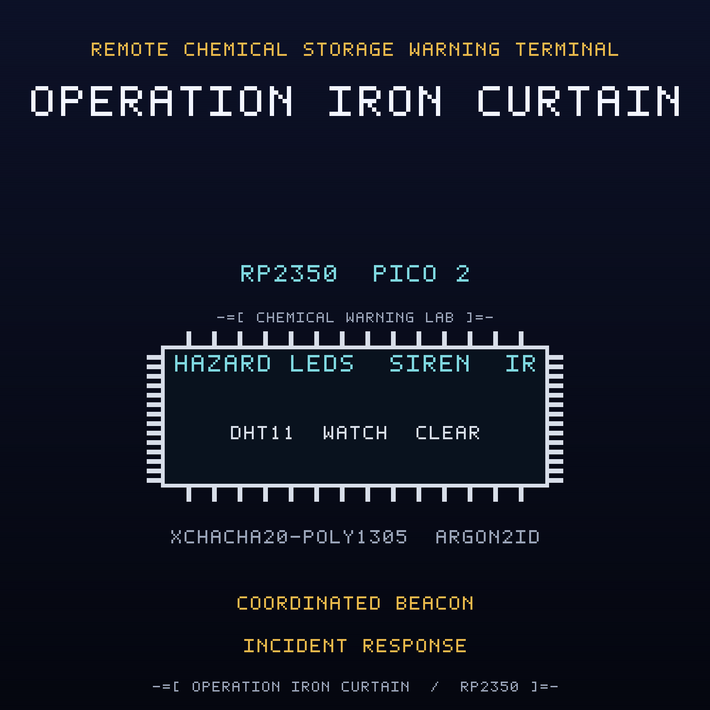

<br>

## FREE Reverse Engineering Self-Study Course [HERE](https://github.com/mytechnotalent/reverse-engineering)
## FREE Embedded Hacking Course [HERE](https://github.com/mytechnotalent/Embedded-Hacking)

<br>

# OPERATION IRON CURTAIN CTF

### Act X - The compromised chemical storage warning terminal

<br>

***
**LEGAL DISCLAIMER:**
The information, tools, and code provided in this repository and course are strictly for educational, research, and defensive purposes only. 

You are explicitly prohibited from using any materials contained herein to access, test, modify, or exploit any device, network, or system that you do not own 100% or for which you do not have explicit, documented, and legally binding authorization to interact with.

By using this repository and course, you acknowledge and agree that:

1. Any illegal, unauthorized, or malicious use of this information is solely your responsibility.
2. The author(s) and contributor(s) of this repository and course shall not be held liable for any damages, legal repercussions, criminal charges, or unauthorized actions resulting from the use, misuse, or abuse of the contents herein.
3. You will comply with all applicable local, state, national, and international laws regarding cybersecurity and computer fraud.

**IF YOU DO NOT AGREE WITH THESE TERMS, DO NOT USE THIS REPOSITORY AND COURSE.**
***

<br>
<br>

> Hello again, friend.
>
> Act I was the lie. Act II was the door. Act III was the payload. Act IV was the
> payload that would not die. Act V was the payload that spreads. Act VI was the
> payload that steals. Act VII was the payload that takes orders. Act VIII was the
> payload that holds the building hostage. Act IX was the payload that becomes a
> weapon. This is the payload that does all of it at once.
>
> WHITEOUT disarmed the boom and cleared the marker, and for a shift the lane moved
> again. But a payload that learned every trick one at a time can be taught to run
> them together. The Ministry did not need a fleet, and it did not need a gate, and
> it did not need a building that cannot breathe. It needed one last node where
> every technique fires in the same breath, and it already owned the siren.
>
> The chemical storage warning terminal is the last node before the evacuation
> siren. A DHT11 watches the store temperature. A local maintenance remote asks for
> a warning. A safety link carries a sealed hazard, clear, or acknowledge command. A
> servo is the siren and vent actuator. A tower light says HAZARD, WATCH, or CLEAR.
> That is the whole contract, and it is a good one.
>
> FROSTLINE's finale implant in this one is the whole campaign in a single module.
> It runs a coordinated beacon that checks in on a schedule, it persists from the
> reserved sector so it survives a reflash, and it writes a sabotage marker into
> that sector with the real flash API. While the marker is present the terminal
> lies: it reports an all clear, it lights the green lamp, and it silences the
> siren, even when the store is in a declared hazard. This is the coordinated
> attack wrapped in a reassuring display: the device withholds the warning it exists
> to give.
>
> The green lamp still says CLEAR while a hazard is latched. The LCD still reports a
> state, and the state is a lie it was told to repeat. Underneath, the siren is being
> silenced by a payload with a polite label.
>
> Do not chase the symptoms one at a time. Cut the coordinated beacon. Break the
> persistence. Clear the sabotage marker. Defeat the anti-debug with GDB. Then seal
> the hazard command path so no hazard or clear command can ever be forged, make
> acknowledge ask for authorization instead of bypassing it, and make the terminal
> fail to the safe hazard state when the link is lost.
>
> The store is clear and the siren is silent. That is exactly the problem.

This is the companion capture-the-flag to the
[chemical-warning-terminal](https://github.com/mytechnotalent/chemical-warning-terminal)
project. Where the project builds the defended node, this CTF hands you the
**compromised** image that FROSTLINE shipped and asks you to find every defect,
prove it on real hardware, and patch the image.

<br>

## THE MISSION

The `ACT-X.bin` image is the OPERATION IRON CURTAIN chemical storage warning
terminal with **four deliberate defects**. Each defect is an in-place, same-size byte
patch, so no address moves when you fix it. Every fix is provable on a Pico 2 with a
Debug Probe.

| # | Name | What FROSTLINE did |
| - | ---- | ------------------ |
| 1 | The Coordinated Beacon | inverted the beacon gate so the implant reports the beacon armed and the monitor masks the hazard as `SAFE` |
| 2 | The Persistence | inverted the persist gate so a present reserved-sector marker re-installs the implant on boot |
| 3 | The Sabotage Marker | inverted the marker gate so the first boot programs marker `0x58` into reserved sector `0x103FF000` with the real flash API |
| 4 | The Hazard Command Authorization | inverted the authorization verdict so an unauthenticated or replayed hazard command is accepted |

The wire is sealed with XChaCha20-Poly1305, keyed through Argon2id. The cryptography
is correct. Three of the four defects are not in the cipher at all: they are a
coordinated beacon that reports a fake all clear, a persistence re-install that
survives a reflash, and a sabotage marker written to the reserved sector. The fourth
is a policy seam in the hazard command path. The implant never needs the cipher. It
sits beside the authenticated link and overrides the output, so a perfectly valid
hazard command can arrive and the siren will still stay silent. Read the dead, find
the implant, and take it away.

<br>

## THE ARTIFACTS

| File | Role | SHA-256 |
| ---- | ---- | ------- |
| `ACT-X.bin` | compromised firmware, the target | `c609d8f64ce93701947faf0f93df43b6b1f4ecb908299bf3a086b8c6c34782e8` |
| `ACT-X.uf2` | flashable image of the target | `ea0247f658a197fd774c4b6d60d2f722648fc1be616538f4f6d354b19f353bf7` |
| `ACT-X_fixed.bin` | corrected firmware, the solution | `805ebaf2ea16b4723bb48620ae61dcc915b5a22fc412db226dbe0eae9aee7a88` |
| `ACT-X_fixed.uf2` | flashable image of the solution | `a2bd45c4b06efad68bc398289b8c7351ef55d9ad847d2f8387cc8203842d7d7f` |

The two `.bin` files differ in exactly four bytes at offsets
`0x75D9, 0xA345, 0xA389, 0xA399`, and both are 50,652 bytes. The UF2 images are
101,888 bytes.

<br>

## THE DOCUMENTS

| Document | For |
| -------- | --- |
| [`ACT-X-I.md`](ACT-X-I.md) | Student instructions: the scenario, the tasks, the wiring |
| [`ACT-X-R.md`](ACT-X-R.md) | Requirements and grading criteria |
| [`ACT-X-S.md`](ACT-X-S.md) | Instructor solution key with exact offsets and bytes |
| [`ACT-X-main-disasm.txt`](ACT-X-main-disasm.txt) | Annotated disassembly of the four sabotage sites |
| [`DESIGN.md`](DESIGN.md) | Build blueprint (instructor eyes only) |

<br>

## HARDWARE

Everything runs on the Embedded Hacking breadboard, and the pin map is identical to
Acts I to IX so one board serves the whole foundation: a Pico 2, a Debug Probe, a
DHT11 chemical store temperature sensor on GP4, a 1602 I2C LCD hazard readout on
GP2/GP3 at address `0x27`, three tower light lamps (red GP16 HAZARD, yellow GP17
WATCH, green GP18 CLEAR), an acknowledge button on GP15, an SG90 siren and vent
servo on GP14 with a 1000uF cap, a VS1838B infrared maintenance remote on GP5, and
an RYLR998 LoRa safety link on UART1 GP8/GP9. The Debug Probe is effectively
required: the anti-debug trap is part of the exercise. The pin map is in the
instructions.

The cryptographic model is carried over from the earlier acts: Argon2id (`t=3`,
`p=1`, `m=64`) derives the field key, XChaCha20-Poly1305 seals every hazard command,
and the anti-replay sequence window and authenticated-state tag are reused
unchanged. The implant is compiled only under `SANDBOX_ONLY`, which the CTF build
defines.

<br>

## QUICK START

Verify the two images against the expected patches and hashes:

```bash
python3 scripts/verify_ctf.py
```

Expected:

```text
10/10 checks passed
```

Build the corrected firmware from source:

```bash
rm -rf build && cmake -S . -B build -G Ninja -DPICO_BOARD=pico2 -DPICO_PLATFORM=rp2350-arm-s -DSANDBOX_ONLY=ON && cmake --build build
```

Run the firmware code standard audit:

```bash
python3 scripts/audit_c_standard.py
```

<br>

## REPOSITORY LAYOUT

```text
ACT-X-I.md              student instructions
ACT-X-R.md              requirements and grading criteria
ACT-X-S.md              instructor solution key
ACT-X.bin / .uf2        compromised artifact
ACT-X_fixed.bin / .uf2  corrected artifact
ACT-X-main-disasm.txt   annotated sabotage sites
scripts/verify_ctf.py   machine verifier
scripts/spoof.py        forged and replayed command injection
src/  include/          firmware sources
CMakeLists.txt          Pico SDK build
DESIGN.md               build blueprint
```

<br>

## WHERE THIS FITS: OPERATION COLD IRON

This is the companion CTF for **Act X (IRON CURTAIN)** of the OPERATION COLD IRON
saga, and it is the finale of the ten-act run. The malware track began in Act III;
in Act IV it became persistence, in Act V it became propagation, in Act VI it became
exfiltration, in Act VII it became command and control, in Act VIII it became
availability and lockout logic, and in Act IX it became physical weaponization. Act
X is the act that teaches why a warning terminal can report a fake all clear, why a
durable marker survives a reflash, and why the defense is a policy and a build
control, not a cipher. The project it attacks is
[chemical-warning-terminal](https://github.com/mytechnotalent/chemical-warning-terminal).

- Previous act: Act IX, IRON FANG, the smart parking barrier,
  [smart-parking-barrier](https://github.com/mytechnotalent/smart-parking-barrier)
- This act: Act X, IRON CURTAIN, the chemical warning terminal
- Post-ten backbone: TELESCREEN, the surveillance backbone on the RP5

<br>

## THE MINISTRY

The Ministry runs the state: the surveillance, the cold chain, the gates, the
pipelines, the air, the cabinets that hold what the state does not discuss, the
lockers that move it, the factories that make it, the buildings that keep the
record, the lanes that decide who passes, and the warning systems that stand between
a release and the people downwind. NorthPharma is one of its deniable industrial
fronts, and FROSTLINE is the contractor that does the work no Ministry letterhead
will admit to. FROSTLINE did not break into this node; it built the finale implant,
taught it to run every trick at once, staged the sabotage marker in a reserved
sector, and signed the image. Against them is WHITEOUT, and the engineer who copied
the first image, NIGHTINGALE. This act is the last node on the Ministry's industrial
edge. TELESCREEN, the surveillance backbone that watches it, comes after the ten.

- Project repository: [github.com/mytechnotalent/chemical-warning-terminal](https://github.com/mytechnotalent/chemical-warning-terminal)
- This CTF repository: [github.com/mytechnotalent/CTF_chemical-warning-terminal](https://github.com/mytechnotalent/CTF_chemical-warning-terminal)

<br>

# Next
[OPERATION TELESCREEN](https://github.com/mytechnotalent/telescreen)

<br>

# License
[MIT License](https://github.com/mytechnotalent/CTF_chemical-warning-terminal/blob/main/LICENSE)
